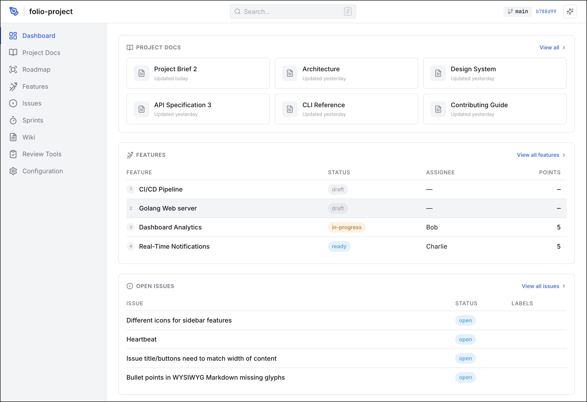

# Folio

An experimental, local-first project management tool that stores features, plans, issues, and docs as markdown files on disk — designed for teams working with AI agents. Folio provides a web UI for managing context and a CLI for agent integration.



## Philosophy

**Agile for agentic engineering.** Folio shares the principles of Scrum — transparency, inspection, and adaptation — and extends them to a world where AI agents are first-class participants in the development process.

**Features, not user stories.** The core artifact in Folio is the *Feature*, composed of a `FEATURE.md` (what to build) and a `PLAN.md` (how to build it). This is a lightweight form of spec-driven development where each feature is co-owned by product, engineering, and design.

**Three tiers of context.** Agentic development requires context, and that context should be colocated and versioned with the rest of a project:

- **Evergreen** — Long-lived project documents: purpose, personas, tech stack, design system, conventions (`project-docs/`)
- **Development** — Task-level context: features with specs and plans, issues with reproduction steps and analysis (`features/`, `issues/`)
- **Rolling knowledge** — Learnings, decisions, and notes that evolve over time (`wiki/`)

**Files, not databases.** All project data is stored as plain markdown files with YAML frontmatter. No database to set up, migrate, or back up. The filesystem is the source of truth, and your data is always readable, grep-able, and diffable.

**Complementary, not competing.** Folio is not an IDE, not an agent harness, not version control, and not a communication tool. It is intended to complement these tools — not replace them. It works alongside git, editors, CI/CD, Slack, and whatever agent framework you prefer.

**A single binary.** One Go binary provides a web interface for managing context documents and is designed to also serve as a CLI tool for agents.

**Opinionated but customizable.** Folio includes sane defaults for organizing context (workflow states, directory structure, frontmatter schemas) but can be customized to fit your team's process.

**Skills** *(future)*. Folio will be able to install skills into common agent tools (Claude Code, OpenCode, etc.) to give agents direct access to project context.

## Data Model

All data lives under a single directory (`./folio` by default) within the overall project:

```
folio/
├── folio.yaml              # Project config (workflow states, etc.)
├── team.md                 # Team roster (YAML frontmatter)
├── roadmap.md              # Kanban board definition
├── project-docs/           # Evergreen context
│   ├── project-brief.md
│   ├── design.md
│   └── ...
├── features/               # One directory per feature
│   └── my-feature/
│       ├── FEATURE.md      # Metadata in frontmatter + description
│       ├── PLAN.md         # Implementation plan (optional)
│       └── *.md|*.json|... # Supporting artifacts
├── issues/                 # One directory per issue
│   └── my-issue/
│       ├── ISSUE.md        # Metadata in frontmatter + description
│       └── ...             # Supporting artifacts
└── wiki/                   # Rolling knowledge base
    └── page-name.md
```

Folio supports managing multiple projects from a single server. Projects are discovered from two sources:

1. **Local directory** — A `./folio` directory relative to where `folio web` is run
2. **Project list** — `~/.local/folio/project-list.yaml`, a persistent registry of known projects

```yaml
# ~/.local/folio/project-list.yaml
active: my-project
projects:
  - name: my-project
    path: /path/to/my-project/folio
  - name: another-project
    path: /other/path/folio
```

When multiple projects are registered, the web UI shows a project switcher dropdown in the header. Use `folio projects` to manage the project list from the CLI.

- `folio.yaml` configures the project name, version, and workflow. The workflow defines the set of states a feature moves through (e.g., `draft`, `ready`, `in-progress`, `review`, `done`) and which state new features start in.
- **Project docs** in `project-docs/` are read-only evergreen documents (project brief, design system, API spec, conventions) that provide stable context for the team and for AI agents.
- `team.md` is a team roster. Frontmatter lists each member's name, role, and optional GitHub handle. Member names are used when assigning people to features and issues.
- `roadmap.md` defines a kanban-style roadmap board. Frontmatter describes the board's columns (default: `now`, `next`, `later`), optional swim-lane rows, and cards. Cards can be linked to features so the roadmap stays connected to the backlog.
- **Features** are the core work artifact. Each feature gets its own directory under `features/`, with a `FEATURE.md` containing YAML frontmatter (title, status, priority, assignees, points, sprint, tags) and a markdown body that serves as the feature spec. An optional `PLAN.md` describes how to build it. The directory can also hold supporting artifacts — diagrams, mockups, JSON fixtures, or any other relevant files.
- **Issues** follow the same pattern under `issues/`. Each `ISSUE.md` has frontmatter for title, status (`open`, `in-progress`, `closed`), type (`bug`, `task`, `improvement`, `chore`), priority, assignees, and an optional link to a parent feature. The body holds the description, reproduction steps, or analysis.
- **Wiki pages** are standalone markdown files in `wiki/` for rolling knowledge — architecture decisions, onboarding guides, retrospective notes. Each page has a title, optional icon, and auto-generated description.

## CLI

The `folio` binary provides both a web server and a set of commands for managing project data directly from the terminal — useful for scripting, CI, and AI agent integration. All commands support `--json` for machine-readable output.

**Global flags** (available to all subcommands):

| Flag | Description | Default |
|------|-------------|---------|
| `--data` | Path to the Folio data directory | `./folio` (or `FOLIO_DATA` env var) |
| `--log-dir` | Override log file directory | `~/.local/folio/logs` (production only) |

### `folio init`

Creates the `folio/` directory structure with default configuration, wiki page templates, and example content. Use `--force` to overwrite an existing directory.

```bash
folio init                          # Create folio/ in current directory
folio init --data /path/to/project  # Create at a specific path
```

### `folio web`

Starts the web server, serving the API and the embedded frontend SPA. On first run, Folio creates `~/.local/folio/` and an empty `project-list.yaml` if they don't exist. If a `./folio` directory is found in the current working directory that isn't already registered, Folio will prompt to add it to the project list (or log a message in non-interactive mode).

```bash
folio web                           # Start on port 2600, data from ./folio
folio web --port 8080               # Custom port
folio web --data /path/to/project   # Custom data directory (single-project mode)
folio web --projects /path/to/list  # Custom project-list.yaml (skips ~/.local/folio)
folio web --mdns                    # Advertise as folio.local via mDNS
folio web --mdns=myproject          # Advertise as myproject.local
```

| Flag | Description | Default |
|------|-------------|---------|
| `--port` | Port to listen on | `2600` |
| `--static` | Path to frontend dist directory | Embedded (production) |
| `--projects` | Path to a custom project-list.yaml | `~/.local/folio/project-list.yaml` |
| `--mdns` | Enable mDNS with optional hostname | Disabled; default hostname `folio.local` |

### `folio projects`

Commands for managing the project list. Alias: `folio project`. Projects are stored in `~/.local/folio/project-list.yaml` (or a custom path via `--projects`).

```bash
folio projects                       # List all registered projects
folio projects list                  # Same as above
folio projects add /path/to/folio    # Register a project directory
folio projects add /path --name "My Project"  # Register with a custom name
folio projects remove my-project     # Remove a project (cannot remove active)
folio projects activate my-project   # Set the active project
```

### `folio features`

CRUD commands for managing features. Alias: `folio feature`.

```bash
folio features list                              # List all features
folio features list --status in-progress,review  # Filter by status
folio features list --assignee Alice --sort priority
folio features get my-feature                    # Show a single feature
folio features create "My Feature" --priority high --body "Description here"
folio features update my-feature --status in-progress --tags "backend,api"
folio features delete my-feature
```

### `folio issues`

CRUD commands for managing issues. Alias: `folio issue`.

```bash
folio issues list                                # List all issues
folio issues list --type bug --status open       # Filter by type and status
folio issues list --feature my-feature           # Issues linked to a feature
folio issues get my-issue                        # Show a single issue
folio issues create "Fix login bug" --type bug --priority high --feature user-auth
folio issues update my-issue --status closed
folio issues delete my-issue
```

### `folio docs`

Read-only commands for viewing project documents.

```bash
folio docs list                     # List all project documents
folio docs get project-brief        # Show a specific document
```

### `folio doctor`

Runs health checks against the `folio/` directory to find structural issues, invalid frontmatter, broken references, and other problems. Exits with code 1 if any checks fail.

```bash
folio doctor                        # Run all health checks
folio doctor --json                 # Machine-readable output
folio doctor --data /path/to/project
```

Doctor validates:

- **Directory structure** — required directories exist (`features/`, `issues/`, `wiki/`, etc.)
- **Config** — `folio.yaml` exists, parses correctly, and has required fields
- **Feature frontmatter** — all features have valid YAML frontmatter with valid status and priority values
- **Issue frontmatter** — all issues have valid frontmatter with valid status, type, and priority values
- **Wiki pages** — all wiki pages parse correctly and have titles
- **Team file** — `team.md` parses correctly and members have names
- **Roadmap consistency** — cards reference valid columns and rows
- **Duplicate slugs** — no slug collisions between features and issues
- **Referential integrity** — issue `feature` references and roadmap card `featureSlug` references point to existing features

The same checks power the health panel in the web UI dashboard.

### `folio version`

Prints the folio version, commit hash, build date, and Go version.

```bash
folio version                       # Human-readable output
folio version --json                # Machine-readable output
```

## Frontend

The web UI is a React single-page application embedded into the Go binary for production deployments.

- **Framework:** React 19 with react-router-dom v7
- **Build tool:** Vite 8
- **Styling:** Tailwind CSS 4 + custom CSS
- **Data fetching:** TanStack React Query
- **Editor:** TipTap (rich text) + CodeMirror (code artifacts)
- **Drag and drop:** dnd-kit
- **UI components:** shadcn/ui primitives (Radix UI)

In development, the frontend runs as a separate Vite dev server and proxies API requests to the Go backend.

## Getting Started

### Prerequisites

- **Go** 1.21+
- **Node.js** 20+ and **pnpm** 9+ (for building the frontend)
- **[just](https://github.com/casey/just)** command runner

### Quick Start

```bash
just install        # Install all dependencies (pnpm + Go modules)
just dev            # Start Go backend + Vite frontend dev server
```

The dev server starts at `http://localhost:5173` (Vite, proxying API to Go on port 2600), using `testdata/folio` for sample data.

### Common Commands

Run `just` with no arguments to see all available recipes.

| Recipe | Description |
|--------|-------------|
| **Dependencies** | |
| `just install` | Install all dependencies (pnpm + Go modules) |
| **Development** | |
| `just dev` | Start Go backend + Vite frontend dev server |
| **Building** | |
| `just build` | Full production build (frontend + Go binary with embedded SPA) |
| `just build-frontend` | Build the frontend only |
| `just build-go` | Build the Go binary (dev mode, no embedded frontend) |
| `just prod` | Full production build from scratch (install + build) |
| **Testing** | |
| `just test` | Run all tests (Go + frontend) |
| `just test-go` | Run Go tests only |
| `just test-frontend` | Run frontend tests only |
| `just test-watch` | Run frontend tests in watch mode |
| **Coverage** | |
| `just coverage` | Generate combined coverage report (Go + frontend) |
| `just coverage-go` | Generate Go coverage report only |
| `just coverage-frontend` | Generate frontend coverage report only |
| **Linting** | |
| `just lint` | Run all linters (ESLint + go vet) |
| `just lint-frontend` | Run frontend ESLint only |
| `just lint-go` | Run Go vet only |
| **Cleanup** | |
| `just clean` | Clean all build artifacts and coverage reports |

### Production Build

`just build` produces a single self-contained Go binary with the frontend embedded. No Node.js runtime required at deploy time.

### Configuration

Create a `folio.yaml` in your data directory:

```yaml
project: my-project
version: "0.1.0"
workflow:
  states: [draft, deferred, ready, in-progress, review, done]
  default: draft
```

Set `FOLIO_DATA` to point to your project data directory, or use `--data`:

```bash
export FOLIO_DATA=/path/to/my-project
folio web
```

### Logging

- **Dev mode** (`just dev`): Logs are written to the console (stderr).
- **Production builds** (`just build`): The resulting binary logs to `~/.local/folio/logs/folio.log`. Override with `--log-dir`.

## License

MIT — see [LICENSE](LICENSE).
